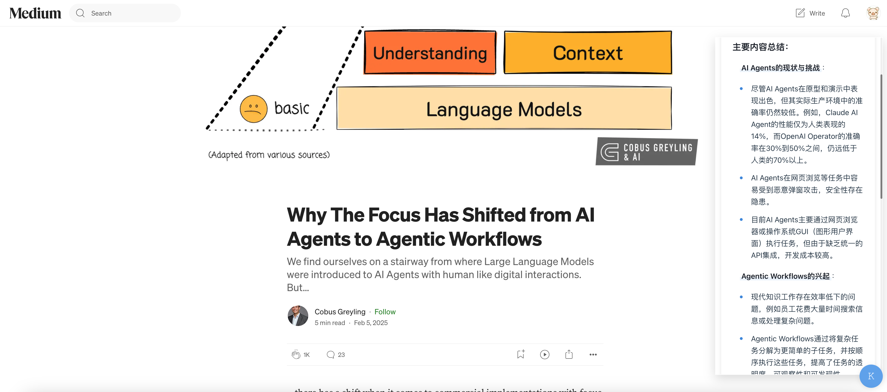

# Koay

[中文文档](./README_zh.md)

A Chrome extension with an interactive AI assistant that supports multiple language models including DeepSeek-R1 and ChatGPT.

## Features

- 🤖 Support for multiple AI models (DeepSeek-R1, ChatGPT)
- 🔒 Secure API key management
- 🎨 Clean and intuitive user interface
- ⚡ Fast and responsive interactions
- 🌐 Works on any website
- 💬 Interactive Chat:
  - Real-time AI Chat: Engage in natural conversations with AI models
  - Reasoning Mode: Get detailed explanations of AI's thought process
  
  The chat interface provides a seamless way to interact with AI models. Toggle the "Reason" mode to see the AI's step-by-step reasoning process.
- 🔄 Smart Translation Features:
  - Quick Translation: Select text and instantly get translations
  - Full Page Translation: Translate entire documents with one click
  - Multi-language Support: Works with various language pairs
  
  The full page translation feature allows you to translate entire web pages with a single click. Right-click anywhere on the page and select "Translate Full Page" to get instant translations of all content.
- 🔍 Advanced Search Capabilities:
  - Deep Search: Quickly find content with keywords
  - Advanced Filtering: Refine search results with precision
- 📝 Document Intelligence:
  - Document Summarization: Get concise summaries of long documents
    
    The summary feature provides a quick way to get the main points of any article. When hovering over article titles, a "Summary" button appears, which generates a concise summary of the content in a clean, floating panel.
  - Key Points Extraction: Automatically identify and highlight important information

## Installation

1. Clone this repository:
```bash
git clone https://github.com/yourusername/koay-bot.git
cd koay-bot
```

2. Install dependencies:
```bash
npm install
```

3. Build the extension:
```bash
npm run build
```

4. Load the extension in Chrome:
   - Open Chrome and navigate to `chrome://extensions/`
   - Enable "Developer mode" in the top right
   - Click "Load unpacked" and select the `dist` folder from this project

## Usage

1. Click the Koay icon in your Chrome toolbar
2. Configure your settings:
   - Select your preferred AI model (DeepSeek-R1 or ChatGPT)
   - Enter your API key
3. Start chatting with the AI assistant on any webpage

## Development

- `npm run dev` - Start development server
- `npm run build` - Build for production
- `npm run lint` - Run ESLint

## Tech Stack

- React
- TypeScript
- Vite
- Chrome Extensions API

## License

This project is licensed under the MIT License - see the [LICENSE](./LICENSE) file for details.
