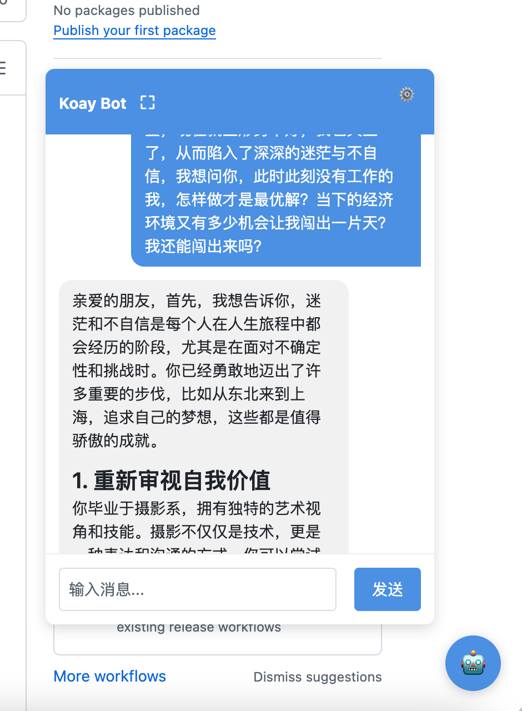
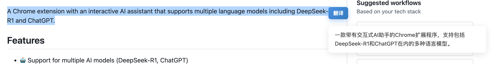

# Koay Bot

[English](./README.md)

一个支持多种语言模型（包括DeepSeek-R1和ChatGPT）的Chrome扩展AI助手。

## 功能特性

- 🤖 支持多种AI模型（DeepSeek-R1、ChatGPT）
- 🔒 安全的API密钥管理
- 🎨 简洁直观的用户界面
- ⚡ 快速响应的交互体验
- 🌐 适用于任何网站
- 🔄 划词翻译功能 - 选中文本后点击翻译按钮即可翻译

## 安装说明

1. 克隆仓库：
```bash
git clone https://github.com/yourusername/koay-bot.git
cd koay-bot
```

2. 安装依赖：
```bash
npm install
```

3. 构建扩展：
```bash
npm run build
```

4. 在Chrome中加载扩展：
   - 打开Chrome浏览器，访问 `chrome://extensions/`
   - 在右上角启用"开发者模式"
   - 点击"加载已解压的扩展程序"，选择项目中的 `dist` 文件夹

## 使用指南

1. 点击Chrome工具栏中的Koay Bot图标
2. 配置设置：
   - 选择你偏好的AI模型（DeepSeek-R1或ChatGPT）
   - 输入你的API密钥
3. 在任何网页上开始与AI助手对话

### 聊天界面


### 翻译功能


## 开发指南

- `npm run dev` - 启动开发服务器
- `npm run build` - 构建生产版本
- `npm run lint` - 运行ESLint检查

## 技术栈

- React
- TypeScript
- Vite
- Chrome Extensions API

## 许可证

本项目采用MIT许可证 - 查看 [LICENSE](./LICENSE) 文件了解详情。